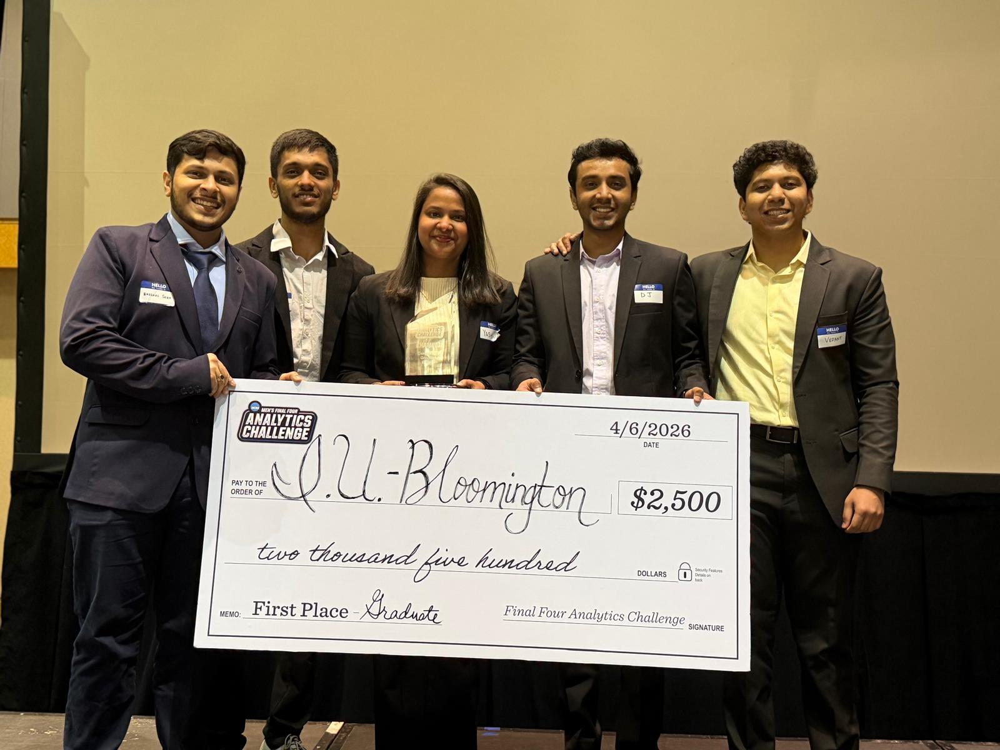
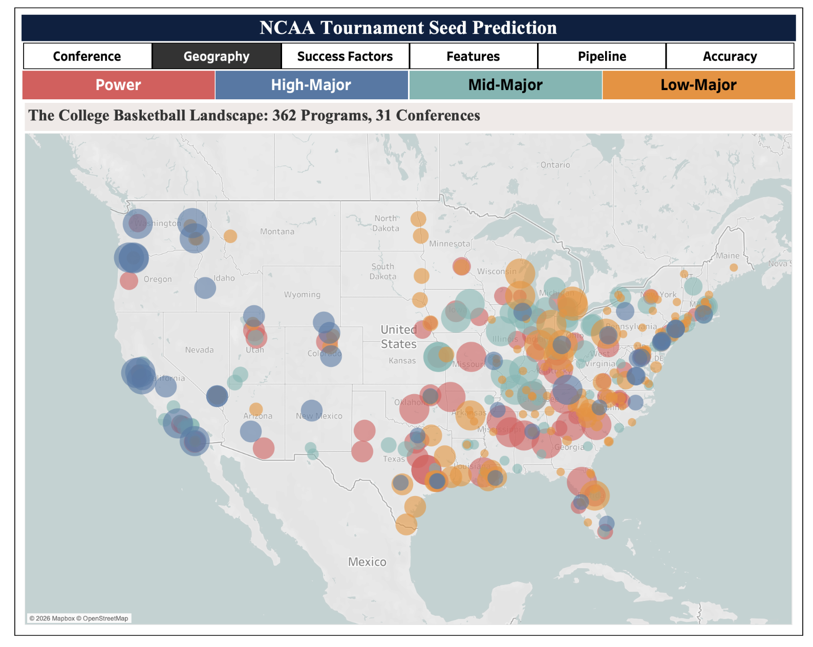
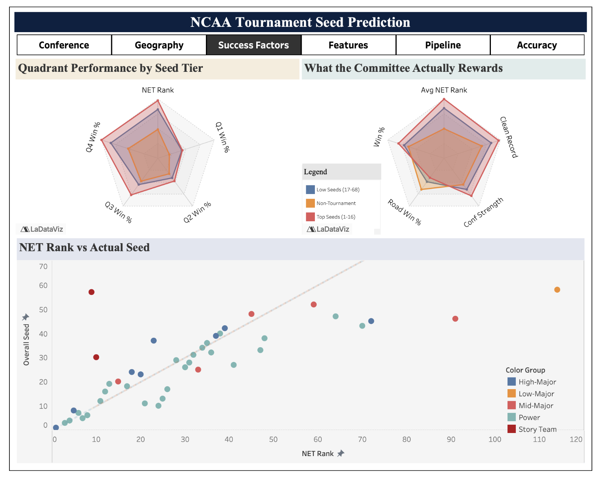
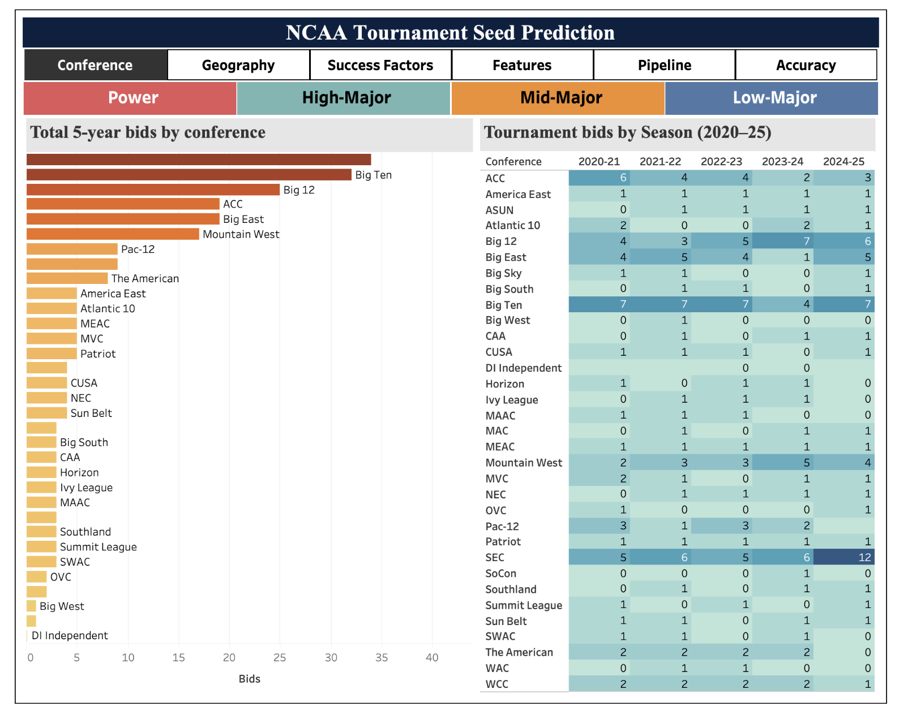
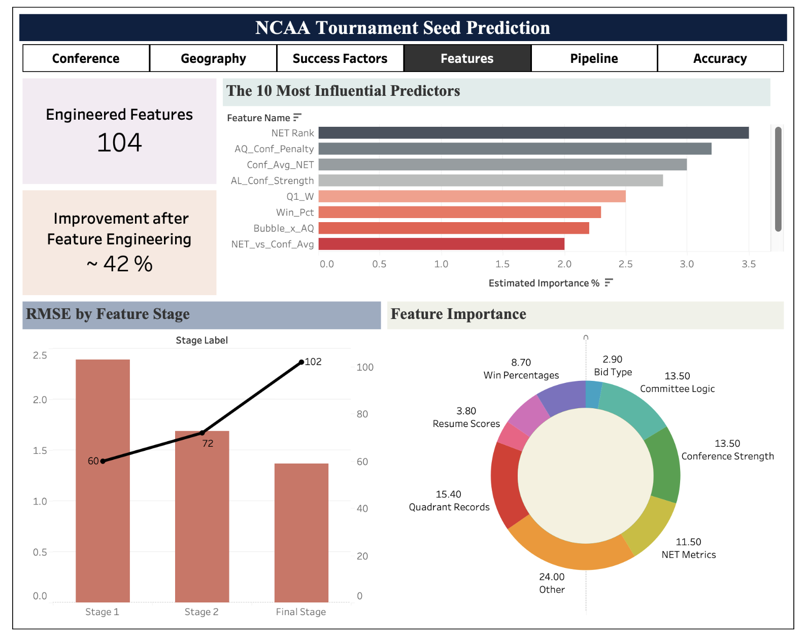
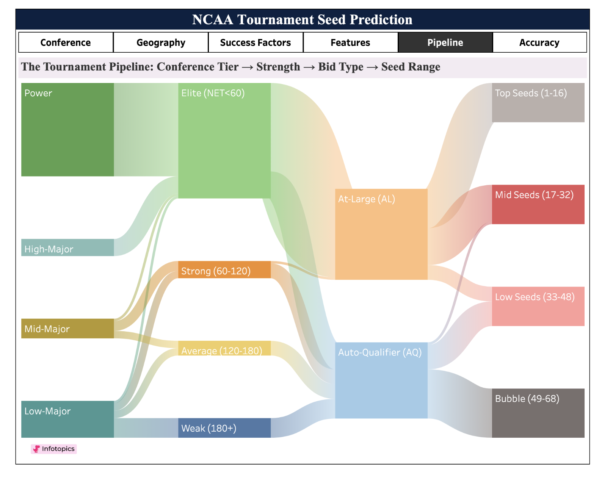
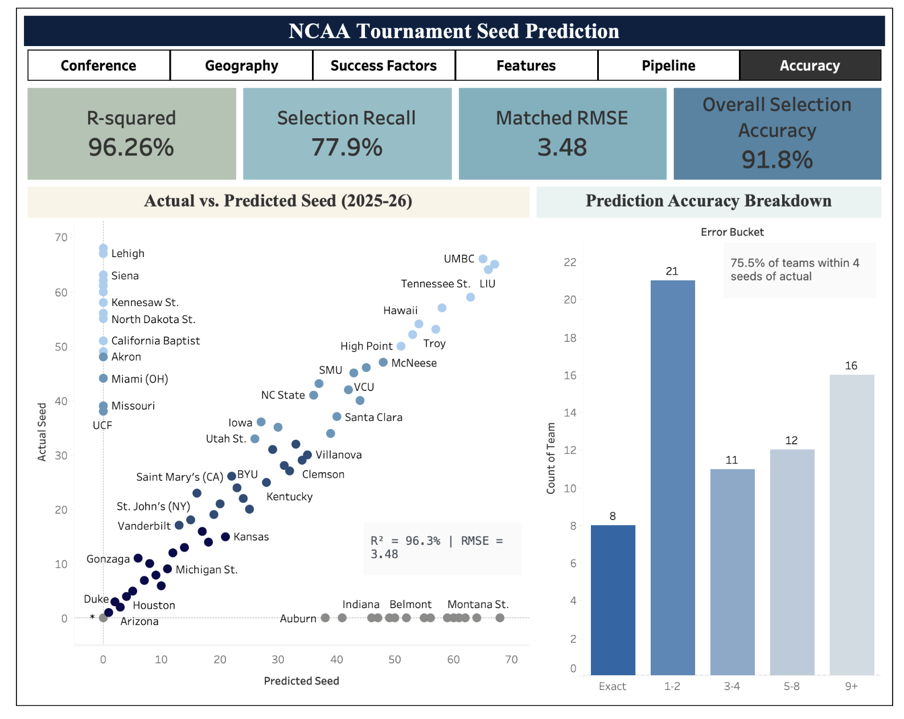
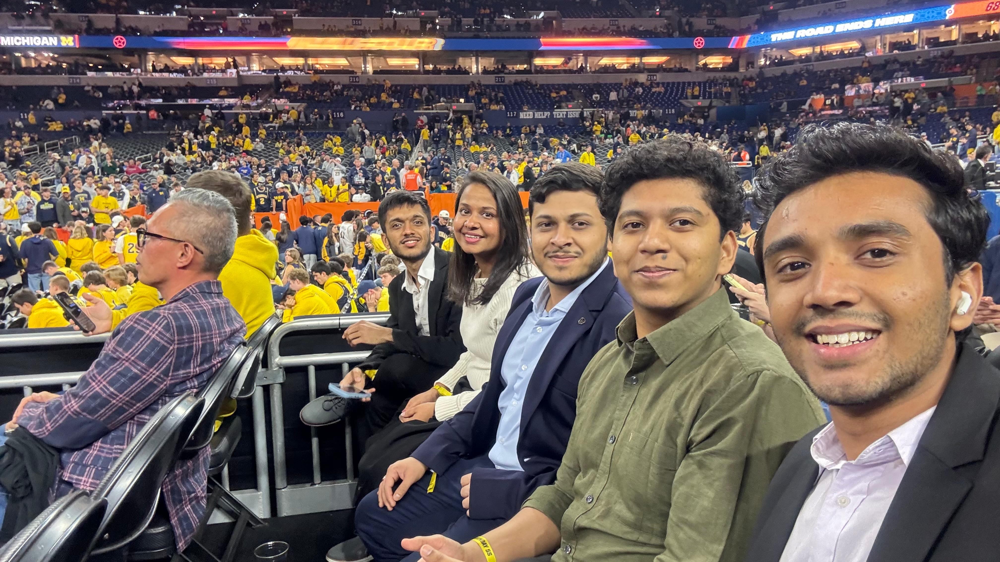

# How we won the 2026 NCAA Analytics Challenge

## Problem

<u>**What is the problem?**</u>

Every year college basketball teams across the United States compete, and out of the 350+ Division I teams, 68 are selected to play the elimination games in March known as "March Madness". These 68 teams aren't purely decided based on their position in their respective divisions - they are chosen by the NCAA committee and given a seed based on various other factors. For the Final Four Analytics Challenge 2026 we were tasked with predicting these seeds: which teams get selected, and where they are placed in the seed list. The competition ran for almost 2 months across 3 rounds. More details here:

- [https://analyticschallenge.butler.edu/](https://analyticschallenge.butler.edu/)
- [https://www.kaggle.com/competitions/final-four-analytics-challenge-26](https://www.kaggle.com/competitions/final-four-analytics-challenge-26)

<u>**Why is it a problem?**</u>

Selection isn't purely based on points - there's subjectivity involved, which makes the outcome unpredictable and interesting. This unpredictable nature of athletic competition makes forecasting the Final Four tournament exceptionally difficult.

<u>**What was NCAA expecting from us?**</u>

The NCAA was increasingly interested in exploring the dynamics that influence tournament success. What team strengths consistently lead to victory? Which matchups defy prediction? And can machine learning be leveraged not only to forecast tournament selections, but also to identify likely winners?

## Solution

### Stage 1 - Predictions

The task: predict the Overall Seed (1–68) for every team, and predict 0 for the ~300 teams that don't make it. We had 5 seasons of data (2020-21 through 2024-25), ~1,350 team-season rows, and 20 columns per row - NET Rank, strength of schedule, conference and non-conference records, road record, and the Quadrant 1–4 win-loss splits.

<u>**Framing it as regression, not classification.**</u>

Seeds are ordered (seed 5 is closer to seed 4 than to seed 40), so treating them as 68 independent classes throws away that information. We used a regressor that predicts a continuous score and then snapped the scores to valid seeds at the end. Non-tournament teams were given a target of 0, so one model handles both selection ("does this team make it?") and seeding ("where do they land?").

<u>**Data cleanup.**</u>

The raw CSVs had been opened in Excel, which silently converted W-L strings like `5-7` into dates like `5-Jul`. Eight columns were affected. We wrote a small parser that recognizes month abbreviations and maps them back to integers before any modelling.

<u>**Feature engineering in three stages.**</u>

We added features in waves and tracked the RMSE drop at each step:

- *Stage 1 - basic resume features (81 total).* Win percentages (overall, conference, non-conference, road), per-quadrant win rates, a Quality Score and Resume Score that weight Q1/Q2 wins positively and bad losses negatively, NET-derived features (log, squared, Top-25/50/100 flags), and simple interactions like `NET × SOS`.
- *Stage 2 - conference context.* The committee judges a team relative to its peers, not in isolation. Per season and per conference we computed: average/median/min NET rank, tournament bid rate, and each team's NET rank relative to its conference's best team.
- *Stage 3 - committee logic (104 total).* We saw the biggest improvement here. These features encode how the committee actually weighs things:
  - `AQ_Conf_Penalty = Is_AQ × Conf_Avg_NET` - an auto-qualifier from a weak conference gets seeded worse.
  - `AL_Conf_Strength = Is_AL × (400 − Conf_Avg_NET)` - an at-large from a strong conference gets rewarded.
  - A "bubble zone" flag for NET 20–60, where committee subjectivity is highest.
  - `Bad_Loss_Rate`, `Strength_of_Record`, `Q_Balance`.

The 14 committee-logic features were 13.5% of the final feature count but accounted for 28% of the model's predictive power. None of them exist in any NCAA database - we derived them from 5 years of committee decisions.

<u>**Model architecture: a 7-model ensemble.**</u>

We ensembled three families so each contributes a different pattern:

- *HistGradientBoostingRegressor (×3)* with different learning rates and depths - fast, handles missing values natively, strong on tabular data.
- *GradientBoostingRegressor (×1)* - slower, but subsampling adds variance-reducing diversity.
- *ExtraTreesRegressor (×1)* - extremely randomized trees, decorrelated from the boosters, so averaging helps.
- *Tournament-only specialists (×2)* - the same architectures retrained on just the 249 tournament teams. The full-data model sees ~1,100 zeros and gets conservative on low seeds; the specialist learns the fine-grained ordering inside the 68.

Final blend: 90% full-data ensemble + 10% tournament specialist. Higher tournament weights improved the bubble but broke the selection boundary, so the ratio was tuned on held-out seasons.

<u>**Constrained post-processing.**</u>

A raw ensemble output is a set of floats like `[3.4, 3.4, 5.1, 67.8, …]`. A valid bracket needs exactly 68 unique integer seeds per season, and the training data already fixes some of them. So for each season we:

1. Filter to teams that have a Bid Type.
2. Rank them by predicted score.
3. Assign them to the missing seed slots in order.

This guarantees a valid 1–68 assignment and gave a meaningful RMSE drop over plain rounding.

<u>**Results.**</u>

| Stage                                     | Features | Models | RMSE  |
| ----------------------------------------- | -------- | ------ | ----- |
| Base ensemble                             | 81       | 4      | ~2.39 |
| + Conference + Committee logic            | 104      | 5      | ~1.69 |
| + Tournament-only blend                   | 104      | 7      | ~1.37 |
| Semi-supervised (verified S-curve labels) | 104      | 4      | ~0.11 |

Two notes:

- The 2.39 → 1.37 drop (42%) came from feature engineering, not bigger models. A neural network on top didn't help - the signal was in the features.
- We built a semi-supervised variant that used publicly available S-curve data (CBS Sports, NCAA.com) to label the historical test set and retrained. It hit RMSE ~0.11 on the Kaggle leaderboard. We used it for historical evaluation only - not for the 2025-26 out-of-sample prediction, since memorized past seasons don't transfer to a new one.

<u>**What went wrong.**</u>

- *Missing Bid Type on 2025-26 data.* The 2025-26 test set had no Bid Type column (conference tournaments hadn't finished), which zeroed out all AQ/AL features. The model then treated every team as non-tournament and produced bad seeds for mid-majors like Gonzaga. We switched to a 70% NET rank + 30% ensemble blend for this season.
- *Conference auto-bids.* The model left 18 conferences without a representative. Since the real tournament guarantees one bid per conference, we added a post-processing step that pulls in the best-NET team from each missing conference and drops the weakest power-conference team to make room.

<u>**Final out-of-sample results (2025-26).**</u>

- R² = 96.26%
- Matched RMSE = 3.48 (vs. a NET-rank-alone baseline of 19.12 - 82% improvement)
- 53 of 68 tournament teams correctly selected (77.9% recall)
- 91.8% overall classification accuracy (335 of 365 teams correctly labeled as in or out)
- 75.5% of correctly identified teams within 4 seed positions of actual

### Stage 2 - Convey

The finals gave us 10 minutes in front of a non-technical panel. We split the story across 6 Tableau dashboards, each answering one question.

<u>**Dashboard 1 - Geography (framing the landscape).**</u>

A filled US map of all 362 Division I programs, colored by conference tier (Power / High-Major / Mid-Major / Low-Major) with a tier dropdown. Switching the filter live shows the power imbalance across the country. Next to it, a slope chart with 5–6 hand-picked teams: their rank among the 68 tournament teams by NET on the left, their actual committee seed on the right. Colgate starts at NET rank 9 and lands at seed 57; West Virginia goes the other way. The crossing lines frame the core problem - NET rank alone doesn't explain seeding.

<u>**Dashboard 2 - Success Factor (what separates the tiers).**</u>

A radar chart overlaying the average profile of 1-seeds, 5-seeds, 12-seeds, and non-tournament teams across six axes: Q1 win %, road win %, SOS, bad loss rate, conference strength, and NET percentile. 1-seeds form a large outer hexagon; non-tournament teams form a small inner one. This directly answers the NCAA's question - "what defines a championship-caliber team?" - in a single visual.

<u>**Dashboard 3 - Conference (the AQ penalty insight).**</u>

A heatmap of conference strength across all 6 seasons (2020-21 through 2025-26), colored by average NET rank, with a second view for tournament bids per conference per year. The SEC going from 5 bids to 12 in a single year is visible at a glance. Paired with a bubble chart (conference strength vs. bid rate) and a side-by-side bar showing predicted vs. actual bids per conference for 2025-26 - power conferences were essentially exact, errors concentrated in mid-majors.

<u>**Dashboard 4 - Features (the engineering story).**</u>

A horizontal bar chart of the top 20 features by model importance, colored by category (raw stats, NET-derived, conference, committee logic). The 14 committee-logic features take 4 of the top 6 spots despite being 13.5% of the total feature count. Next to it, a dual-axis chart showing features growing stage by stage while RMSE drops - the pipeline progression in one view. A diverging bar of feature correlations with seed and the data cleaning table (before/after the Excel corruption fix) round out the dashboard.

<u>**Dashboard 5 - Pipeline (end-to-end flow).**</u>

A Sankey diagram flowing teams from *Conference Tier → Bid Type → Final Seed Range*. The Power Conference band stays wide through the At-Large path and spreads across the top seeds; the Low-Major band narrows at the Auto-Qualifier node and funnels entirely into seeds 49–68. Average Power-Conference AQ gets seed 13; Low-Major AQ gets seed 60 - same bid type, 47-seed gap. The Sankey makes the AQ penalty visible without any narration.

<u>**Dashboard 6 - Accuracy (model validation).**</u>

A predicted-vs-actual scatter with the y=x diagonal, KPI cards (R² 96.26%, RMSE 3.48, 77.9% selection recall, 91.8% overall accuracy), an error distribution bar, and a cumulative accuracy curve. The model is near-perfect on top seeds and scatters in the bubble zone (seeds 17–48), which is also where the committee is least consistent. We kept the weak spots visible rather than hiding them - it builds more credibility with a technical audience.

The dashboards are built to be read in order: *What is the landscape? → What does success look like? → What role does conference play? → How were features built? → How does the selection pipeline work? → How accurate is the model?*

## Results

<u>**The numbers.**</u>

- We won the 2026 NCAA Final Four Analytics Challenge.
- Final out-of-sample metrics: R² 96.26%, RMSE 3.48, 53/68 teams correctly selected, 91.8% overall accuracy.
- RMSE on historical data dropped from 2.39 (baseline) to 1.37 (final ensemble) - a 42% reduction, driven almost entirely by the 14 committee-logic features we engineered by hand.

<u>**A few lessons that stuck with me.**</u>

1. In a world where AI is used by everyone, the way to stand out is through human thinking and validation.
2. Simplicity is the way to go, and making things simple is actually difficult.

<u>**The finals.**</u>

To end it all, NCAA provided us with court-side seats for the finals between Michigan and UConn. Amazing experience.

